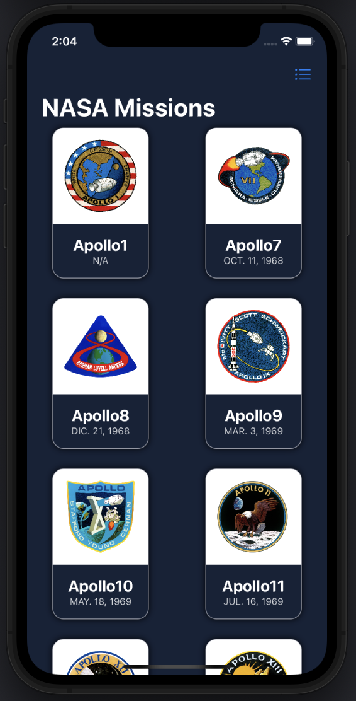
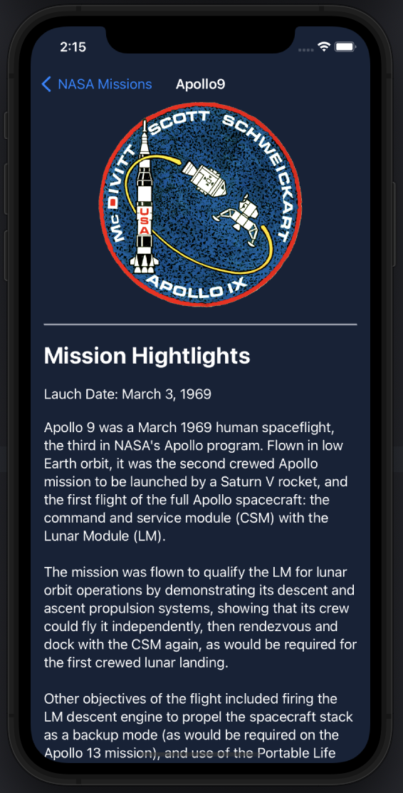
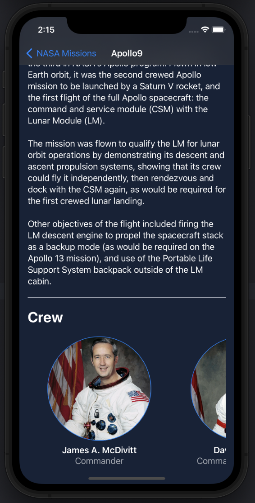
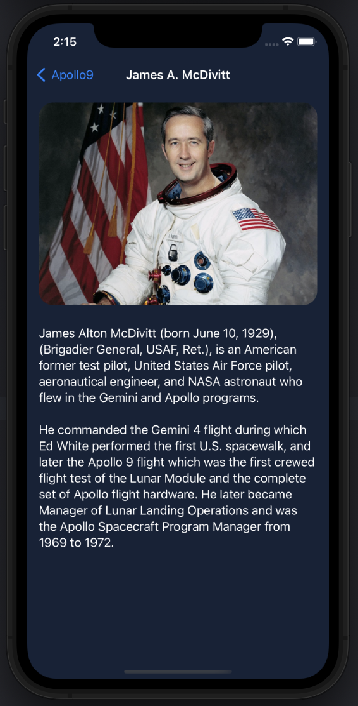

# Moonshots

Hi there!

Today’s app is all about reading files from its bundle, decoding that information to get object we can work with and showing that information. To make that possible, swift provides us with some functionalities that allows us to find our files, turn those files into Strings and then, decoding it into objects. In case, any of these operations didn’t success, our app would be in a state that didn’t make sense to work in so, there is where fatalError let us terminate our app.

This simple app read two files containing a list of NASA’s missions and some of people that took part in those launches. So that, we can access to those missions to see a brief summary of the mission, and from there, accessing to pilots’ information.

To build this app I have used the following tools:

Bundle.main.url: to find the files and to return its URL, this way we can access them.

String(contain: URL): get access to the content of the file turning the data inside into a String. This String, at the same time provides us with the method data that turns the String into a data that can be decoded into objects inside our application.

FatalError: to terminate our application when we detect a state in which does not make sense to keep running our app.

NavigationLink: creates links to other views when we tap on the element wrapped.

LazyGrid: as its name says, it allows us to create a grid of views, giving us a lot of flexibility because Swift will be in charge of readjusting the layout every time when change not only the orientation, but also the size of the screen.

###### Missions

###### Mission view

###### Astronaut view

